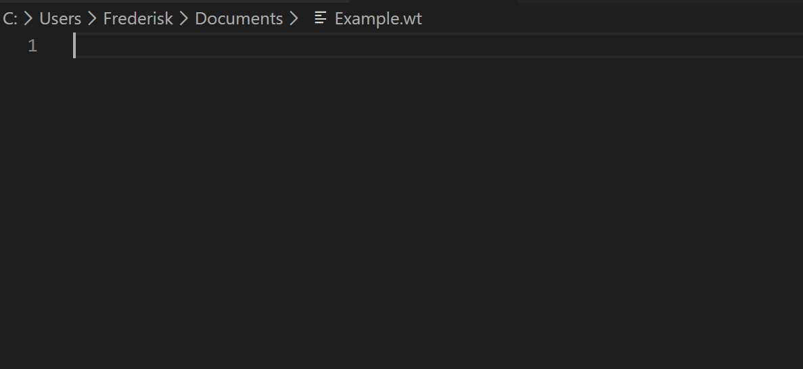
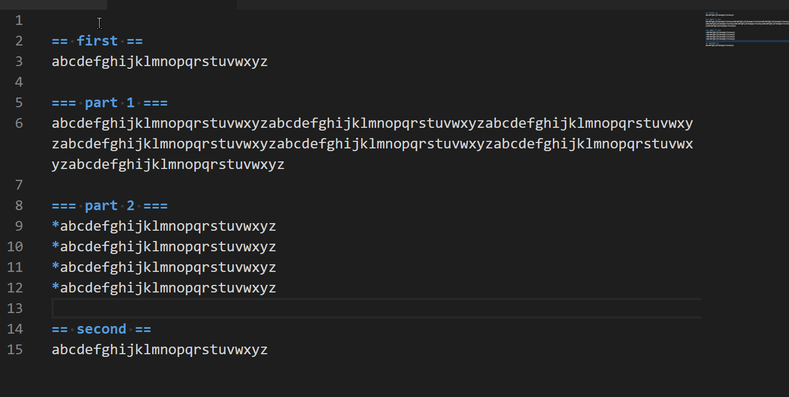
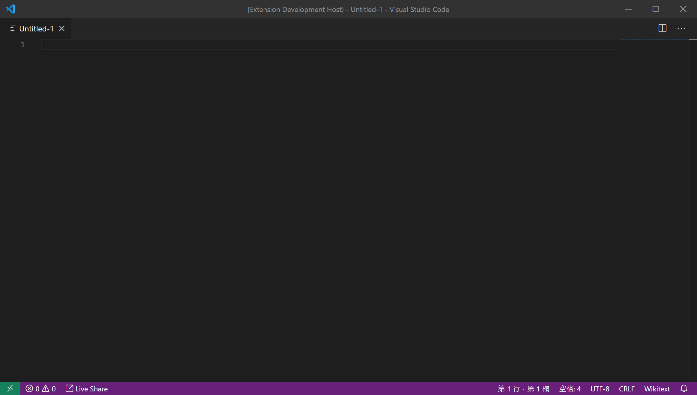

# Wikitext Markup Language Support for Visual Studio Code

This Visual Studio Code Extension provides support of Wikitext Markup language. With this extension, you can more easily discover your grammatical problems through the marked and styled text. The plugin is based on MediaWiki's Wikitext standard, but the rules are somewhat stricter, which helps users write text that is easier to read and maintain.

Of course, the development of this extension is short, and there may be some errors in operation and labeling. If you find a problem, please report it to me immediately for resolution.

## Features

- Color and style annotations of Wikitext can make it easier for users to intuitively find problems in writing grammatical formats.  

- Automatic matching and closing of simple parentheses reduces unnecessary double typing.  

- The special comment syntax\(`<!--#region-->`&`<!--#endregion-->`\) can folds the code for easy reading.  

## Requirements

Please ensure that your VSCode version is higher than 1.43.0, this version requirements may change in the future.

Generally speaking, make sure that your VSCode is always the latest version.

- Press `Ctrl + Shift + P` and choose to execute the `Wikitext: Get Preview` command to get a parsed preview of Wikitext in the currently active text editor. 

- Enter `@[name]` to get a snippet of wikitext. Such as `@table`, `@region`... 

## Release Notes
- Added more snippets and bracket support.
- Added rule to capture keyword.operator
- Changed the minimum version requirements.
- Some mistakes of Template and Internal Link rendering.
- Improve syntax for internal link and template.
- Fixed Some typos.

## Special Thanks
### The help of
[caltaojihun](https://github.com/caltaojihun)

<!-- ## Extension Settings
Include if your extension adds any VS Code settings through the `contributes.configuration` extension point.
For example:
This extension contributes the following settings:
* `myExtension.enable`: enable/disable this extension
* `myExtension.thing`: set to `blah` to do something -->
<!-- ## Known Issues
Calling out known issues can help limit users opening duplicate issues against your extension. -->
