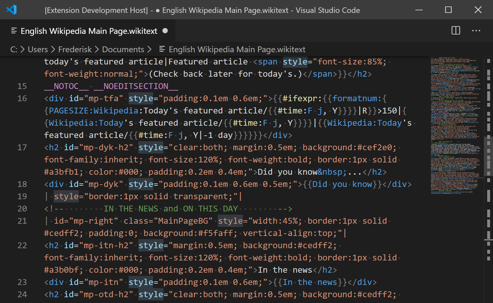
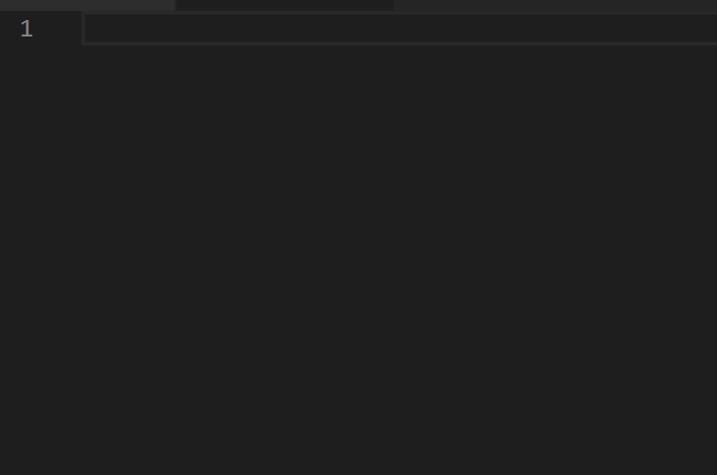

# Wikitext Markup Language Support Extension for Visual Studio Code

[](https://raw.githubusercontent.com/Frederisk/Wikitext-VSCode-Extension/master/LICENSE.txt)
[](https://twitter.com/rwfholme)
[](https://marketplace.visualstudio.com/items?itemName=RoweWilsonFrederiskHolme.wikitext)
[](https://github.com/Frederisk/Wikitext-VSCode-Extension)
[](https://ci.appveyor.com/project/Frederisk/wikitext-vscode-extension)
[](https://www.codefactor.io/repository/github/frederisk/wikitext-vscode-extension)
[](https://www.patreon.com/rwfholme)

This Visual Studio Code Extension provides support of Wikitext Markup language. With this extension, you can more easily discover your grammatical problems through the marked and styled text. The plugin is based on MediaWiki's Wikitext standard, but the rules are somewhat stricter, which helps users write text that is easier to read and maintain.

Of course, the development of this extension is short, and there may be some errors in operation and labeling. If you find a problem, please report it to me immediately for resolution.

If you get help with this project, give this project a star or recommend it to others, thanks!😸

## Features

- Color and style annotations of Wikitext can make it easier for users to intuitively find problems in writing grammatical formats. <br />


- Automatic matching and closing of simple parentheses reduces unnecessary double typing. <br />


- The special comment syntax\(`<!--#region-->`&`<!--#endregion-->`\) can folds the code for easy reading. <br />


- Press `Ctrl + Shift + V` directly in the Wikitext content to get a parsed preview of Wikitext in the currently active text editor.<br />


- Enter `@[name]` to get a snippet of wikitext. Such as `@table`, `@region`, `@title`...<br />


- You can modify the website content by logging in directly in VSCode! Enter the settings page, search Wikitext and find the username and password items, and fill in them. Then press `F1` in the text editor, select `Post your page to the website`!

- Obtain the Wikitext source code directly in VSCode according to the page name without opening the web page. Press `F1` and select `Pull page to edit` to use this function.

- Browse the page by entering the page name. Press `F1` then select `View the page`.

## Usage

### Usage Requirements

Please ensure that your VSCode version is higher than 1.43.0, this version requirements may change in the future.

Generally speaking, make sure that your VSCode is always the latest version.

## Development

### Development Requirements

- [Node.js](https://nodejs.org) (with npm) at least 10.x.x

### How to build this extension yourself

First clone this repository and change directory to the repository, then install VS Code Extension Manager and other packages:

```sh
npm install vsce -g # VS Code Extension Manager
npm install js-yaml -g # js to yaml
npm install # devDependencies

```

Package this project and you will get a vsix file:

```sh
npx vsce package
```

This is it!

## Release Notes

- Disabled edit section links in preview.
- Modified the operation logic of GetHost.
- Removed some unusable code to improve performance.
- Pre-added support for URI invocation, but no official functions have been added yet.
- With PST turned on, Substituted templates, signatures, etc. can now be rendered correctly.

## Special Thanks

- [caltaojihun](https://github.com/caltaojihun)
- [Jason Williams](https://github.com/jasonwilliams)
- [quicktype](https://github.com/quicktype)
- [dj radon](https://github.com/djradon)

<!-- ## Extension Settings
Include if your extension adds any VS Code settings through the `contributes.configuration` extension point.
For example:
This extension contributes the following settings:
* `myExtension.enable`: enable/disable this extension
* `myExtension.thing`: set to `blah` to do something -->
<!-- ## Known Issues
Calling out known issues can help limit users opening duplicate issues against your extension. -->
